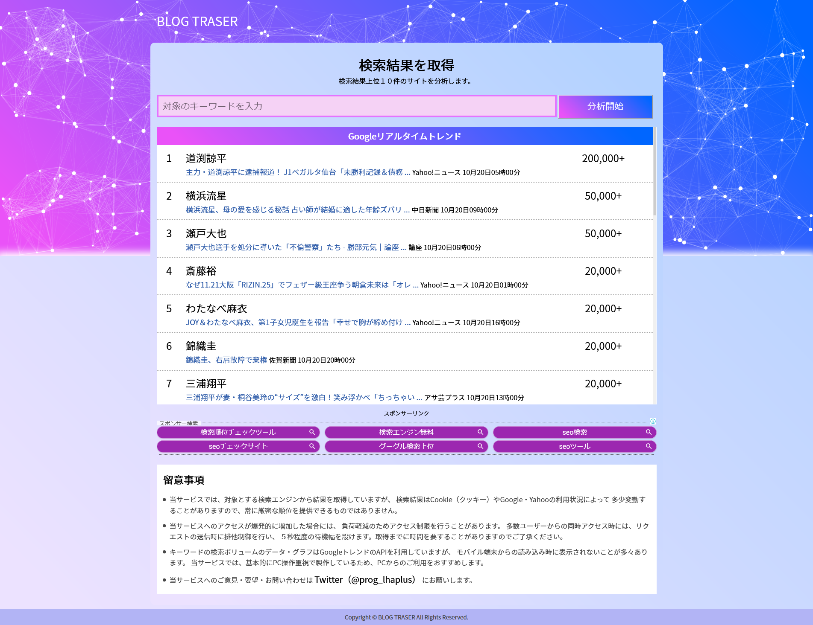
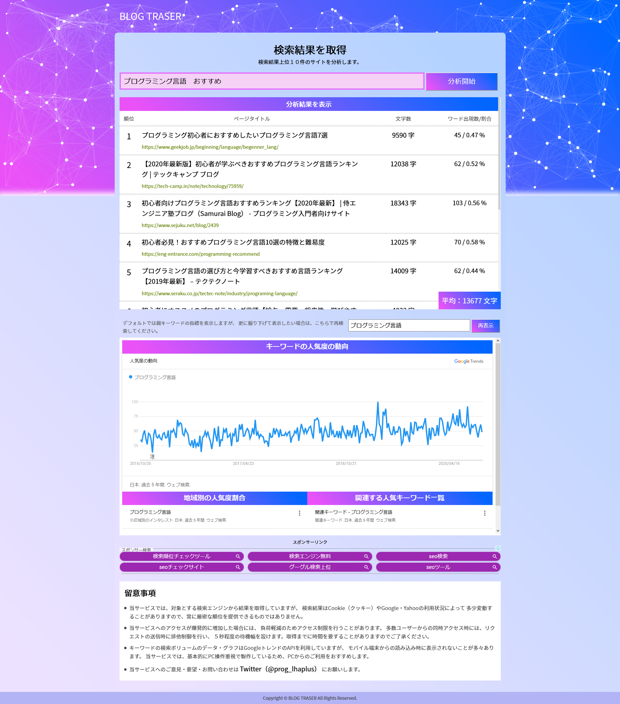

# BLOG TRASER
URL：<a href="https://blog-traser.lhaplus.biz/" target="_blank">https://blog-traser.lhaplus.biz/</a>

このWebツールは、ブログやサイトのSEOを向上させる目的で制作しました。
主な機能は下記の通りです。

<ul>
    <li>調べたい検索キーワードを指定すると、検索結果上位１０件の一覧を取得し、各記事の文字数と検索したキーワードの含有率を表示する。</li>
    <li>その際、対象のキーワードに対しての平均的な文字数の情報も表示する</li>
    <li>対象のキーワードに対するGoogleトレンドの指標を同時に表示し、現在の伸び率をグラフで表示する。</li>
</ul>

<ul>制作するにあたって苦労した点
    <li>このツールはスクレイピング処理によって検索結果から一覧を取得してくるので、ツールへのアクセスが多くなってきた場合に、大量のリクエストを飛ばさないように制御したこと。</li>
    <li>Googleトレンドからの指標を動的に表示させる処理がうまくいかず、かなり苦戦したがiFrameを使った方法で表示できるようにした。</li>
</ul>

以下はスクリーンショットです。

▽トップページ

▽キーワードを検索した結果

